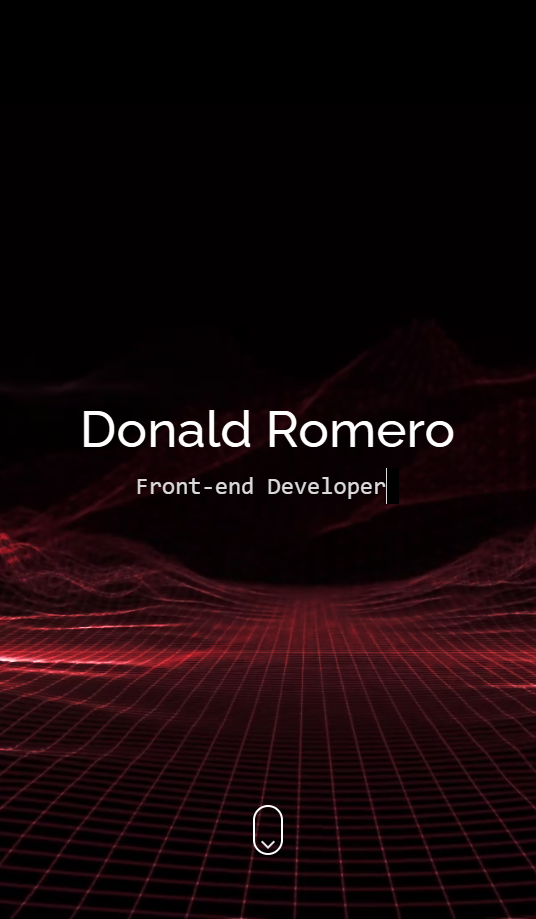

## Ticmas

🏷️ Proyecto Final - CV Ticmas 2023 Argentina Programa 4.0

RESUMEN:
En este trabajo se diseño una landing page de una presentacion CV/portafolio para una identidad falsa generada con la web https://randomuser.me llamada Donald Romero.
Se trabajó principalmente haciendo uso de una framework (bootstrap 5.3.0) con detalles en puro lenguaje css que se puede ver tanto en animaciones como diseños
personalizados de los elementos. A su vez la implementacion de javascript para eventos on-scroll y jquery para garantizar un scroll suave.

🖥️ Github Pages: https://benjatorracobenito.github.io/Proyecto-Final-CV-1-Benjamin-Torraco-Benito/

## Screenshots

 

